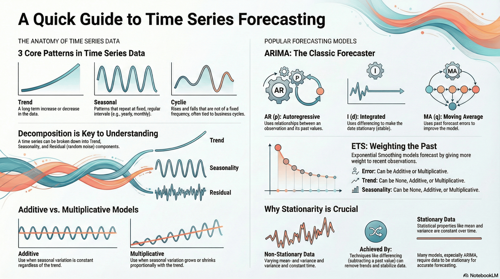

# 3.6 Time-Series Data and Forecasting

## Lesson Overview

## Dependencies

Refer to the following markdown file for the respective sections of the class:

- [Self Studies](./studies.md)
- [Lesson](./lesson.md)
- [Assignment](./assignment.md)
- [Quiz](./quiz.md)
- [Reference](./reference.md)

## Lesson Objectives

Learners will understand:

- Time-series data
- Time-series visualization and analysis
- Forecasting of time-series data

Learners will be able to:

- Plot various time-series charts
- Perform time-series decomposition
- Perform time-series forecasting

## Lesson Plan

| Duration | What                    | How or Why                                                  |
| -------- | ----------------------- | ----------------------------------------------------------- |
| - 5mins  | Start zoom session      | So that learners can join early and start class on time.    |
| 20 mins  | Activity                | Recap on self-study and prework materials.                  |
| 40 mins  | Code-along              | Part 1: Introduction to Time-Series Data and Visualization. |
|          | **1 HR MARK**           |
| 30 mins  | Code-along              | Part 2: Time-Series Decomposition.                          |
| 10 mins  | Break                   |                                                             |
| 20 mins  | Code-along              | Part 3: Forecasting Evaluation and Metrics.                 |
|          | **2 HR MARK**           |
| 50 mins  | Code-along              | Part 4: Forecasting Models- Naive, ARIMA, ETS.              |
| 10 mins  | Briefing / Q&A          | Brief on references, assignment, quiz and Q&A.              |
|          | **END CLASS 3 HR MARK** |
